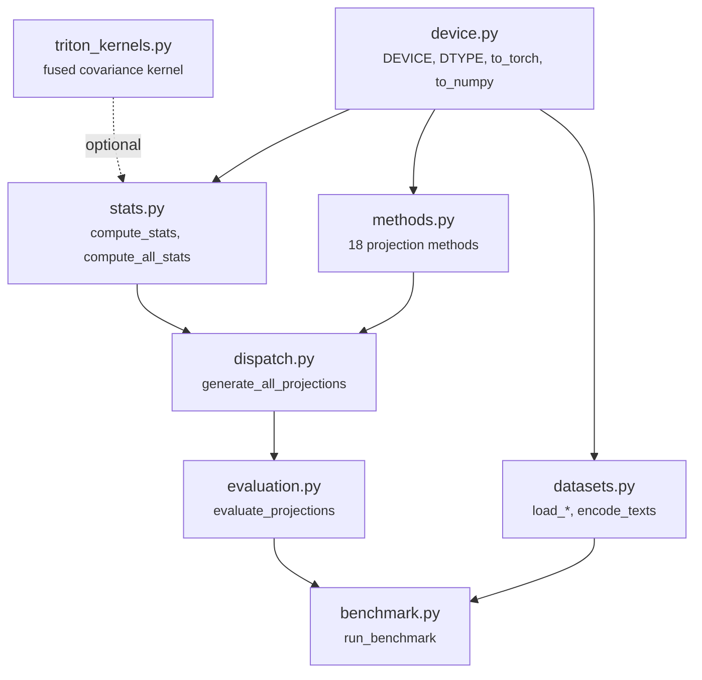
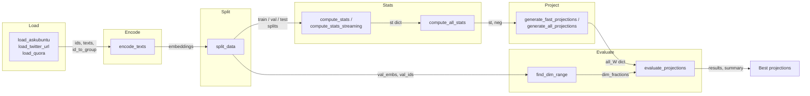
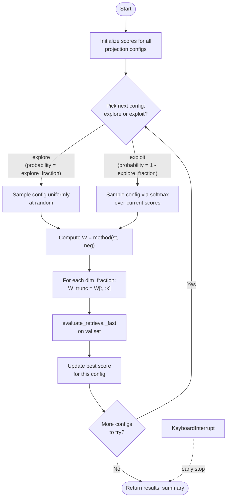

# Architecture

Visual overview of the `litfit` codebase. All diagrams use [Mermaid](https://mermaid.js.org/) syntax.

## Module Dependency Graph

## Data Pipeline Flow

## Method Taxonomy

```mermaid
graph TD
    root["Projection Methods<br/>(18 total)"]

    basic["Basic"]
    asym["Asymmetric"]
    iter["Iterative"]
    rank["Rank-reduced"]
    uber["Uber (hybrid)"]
    contr["Contrastive<br/><em>needs neg</em>"]
    resid["Residual<br/><em>needs neg</em>"]

    root --> basic
    root --> asym
    root --> iter
    root --> rank
    root --> uber
    root --> contr
    root --> resid

    basic --- b1["m_rayleigh"]
    basic --- b2["m_mse"]
    basic --- b3["m_ray_mse"]

    asym --- a1["m_asym_rayleigh"]
    asym --- a2["m_asym_ray_mse"]
    asym --- a3["m_ray_asym_refine"]
    asym --- a4["m_ray_mse_asym_refine"]

    iter --- i1["m_ray_iterate"]
    iter --- i2["m_ray_asym_refine_mse"]

    rank --- r1["m_split_rank_ray"]
    rank --- r2["m_split_rank_ray_mse"]
    rank --- r3["m_split_rank_ray_iterate"]

    uber --- u1["m_uber → (W, bias)"]

    contr --- c1["m_ray_contr_mse"]
    contr --- c2["m_ray_contr_mse_neg"]

    resid --- d1["m_resid_guided"]

    uber --- u2["m_uber_neg → (W, bias)<br/><em>needs neg</em>"]
    uber --- u3["m_uber_contr → (W, bias)<br/><em>needs neg</em>"]
```

## Evaluate Projections Loop

